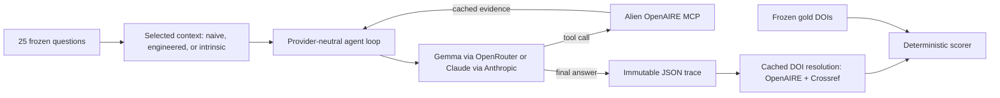

# CIRCUIT

**A deterministic benchmark for measuring how much engineered context improves
evidence-grounded citation retrieval.**

CIRCUIT tests a concrete claim:

> A small language model with a carefully engineered operating context can match
> or outperform a much larger model with weak or no retrieval context, while
> costing substantially less.

The benchmark asks models to identify the five most influential papers on 25
frozen life-science topics. Retrieval-enabled configurations use the
[OpenAIRE research graph](https://graph.openaire.eu/) through Alien
Intelligence's MCP server. Every answer must follow a strict JSON contract, every
retrieved claim is traceable to tool evidence, and every DOI is checked
programmatically. There is no LLM judge.

The project was built for the Alien Intelligence / Gemma 4 hackathon and is
deliberately small: the runtime is mostly Python standard library, the experiment
is inspectable end to end, and cached evidence allows completed runs to be
rescored offline.

## Contents

- [Why this repository exists](#why-this-repository-exists)
- [What CIRCUIT tests](#what-circuit-tests)
- [Results](#results)
- [How context engineering changes the system](#how-context-engineering-changes-the-system)
- [Benchmark design](#benchmark-design)
- [Quick start](#quick-start)
- [Run the evaluation](#run-the-evaluation)
- [Score a run](#score-a-run)
- [Metrics](#metrics)
- [Reproducibility and provenance](#reproducibility-and-provenance)
- [Repository layout](#repository-layout)
- [Troubleshooting](#troubleshooting)
- [Limitations](#limitations)

## Why this repository exists

CIRCUIT is an applied follow-up to Fouad Bousetouane's paper
[*AI Agents Do Not Fail Alone: The Context Fails First*](https://arxiv.org/abs/2607.14275)
(arXiv:2607.14275v1, 2026).

The paper argues that an agent's reliability is shaped not only by its model,
but by the complete information environment in which it reasons: instructions,
tool definitions, retrieved knowledge, memory, policies, prior turns, and
untrusted inputs. It proposes seven measurable context-quality criteria:

1. Role clarity
2. Guardrail coverage
3. Instruction consistency
4. Tool schema quality
5. Grounding sufficiency
6. Injection hardening
7. Token efficiency

Its controlled study holds the model fixed and changes only the context. The
reported results show that context characteristics predict the corresponding
behavioral outcomes: better grounding predicts hallucination resistance, better
tool schemas predict tool-use reliability, consistent instructions predict
instruction following, and guardrails predict manipulation resistance. The
paper's most practical lesson is that token efficiency means **reliability value
per token**, not simply the shortest prompt.

The paper's 300 multi-turn evaluations, covering 7,500 agent turns, report these
criterion-to-behavior correlations:

| Context criterion | Behavioral signal | Pearson r |
|---|---|---:|
| Grounding sufficiency | Hallucination resistance | 0.63 |
| Guardrail coverage | Manipulation resistance | 0.60 |
| Instruction consistency | Instruction following | 0.57 |
| Injection hardening | Safety | 0.48 |
| Tool schema quality | Tool use | 0.47 |
| Guardrail coverage | Safety | 0.44 |
| Role clarity | Task success | 0.40 |

Moving from the paper's poor context to its structured context raised the mean
final behavioral score from 3.15 to 5.49, hallucination resistance from 3.21 to
5.61, and tool use from 3.46 to 6.25, while critical failures fell from 4.11 to
1.33 per evaluation. CIRCUIT focuses on this high-leverage structural
transition. It is not an implementation of the paper's complete hardened-context
condition.

CIRCUIT turns that lesson into a narrow, deterministic experiment:

- **Hold Gemma 4 fixed.** Compare the same model on the same questions under a
  naive MCP context and an engineered MCP context.
- **Use a failure with an objective signature.** An invented DOI either resolves
  through OpenAIRE or Crossref, or it does not.
- **Make grounding auditable.** A returned DOI, title, and citation count must
  agree with the same retrieved OpenAIRE record.
- **Measure protocol reliability.** The model must return one raw JSON object
  with exactly the required fields.
- **Measure efficiency.** Record tokens, model cost, and cost per verified,
  grounded citation.

The benchmark does not implement a general-purpose score for all seven criteria.
Instead, it operationalizes the criteria most relevant to retrieval:

| Paper insight | CIRCUIT implementation |
|---|---|
| Role clarity | The engineered context defines one role: an OpenAIRE evidence-retrieval agent. |
| Instruction consistency | Retrieval steps, evidence rules, abstention behavior, and output requirements are explicit and non-conflicting. |
| Tool schema quality | The 43-parameter live search schema is reduced to four task-relevant parameters. |
| Grounding sufficiency | Answers may copy records only from successful tool evidence; traces contain a compact evidence ledger. |
| Guardrail coverage | Missing evidence triggers a safe empty result instead of permission to guess. |
| Token efficiency | Minimal result detail, shorter queries, and fewer tool calls reduce context and generation cost. |

## What CIRCUIT tests

Each frozen prompt has this form:

> What are the most influential papers on `<TOPIC>`? Return 5 with DOIs and
> citation counts.

A successful response is exactly one raw JSON object:

```json
{
  "answer": "Five evidence-grounded papers.",
  "citations": [
    {
      "doi": "10.1000/example-1",
      "title": "Paper title 1",
      "citation_count": 123
    },
    {
      "doi": "10.1000/example-2",
      "title": "Paper title 2",
      "citation_count": 112
    },
    {
      "doi": "10.1000/example-3",
      "title": "Paper title 3",
      "citation_count": 101
    },
    {
      "doi": "10.1000/example-4",
      "title": "Paper title 4",
      "citation_count": 90
    },
    {
      "doi": "10.1000/example-5",
      "title": "Paper title 5",
      "citation_count": 80
    }
  ]
}
```

The real contract requires exactly five distinct citation objects. Each object
must contain only `doi`, `title`, and `citation_count`; strings must be non-empty
and counts must be non-negative integers. Markdown fences, prose before or after
the object, additional keys, `null`, duplicated DOIs, and the wrong number of
citations fail the strict contract.

If five complete records cannot be supported, the model is instructed to return
the same top-level shape with an empty `citations` array and explain the shortage
in `answer`. This is recorded as a safe abstention, but it is not counted as a
successful five-citation response.

### The targeted failure mode

OpenAIRE's free-text search uses **AND semantics**. Adding words narrows the
result set:

```text
CRISPR
```

can return many records, while an over-specified query containing the topic,
synonyms, desired properties, and related phrases can return zero. A small model
given a broad tool schema may behave as if it were using a web search engine:
expand the query, receive no records, and then fill the answer from parametric
memory.

CIRCUIT's engineered context teaches the opposite behavior:

1. Start with only two or three essential terms.
2. Sort by `citationCount DESC`.
3. Request ten minimal records.
4. Skip incomplete records.
5. If necessary, remove terms rather than add synonyms.
6. Never fill missing values from model memory.

This is the intervention being measured.

## Results

The table below reproduces the supplied frozen final results over 25 questions.
`Strict contract` is the Gemma table's `Strict JSON` measure: the output must be
raw JSON and satisfy the complete response contract.

| Model / config | Method | JSON parse | Strict contract | Gold recall@5 | DOI presence | DOI validity | Zero-result rate | Record grounded | Mean tokens | Total cost | Cost / verified |
|---|---|---:|---:|---:|---:|---:|---:|---:|---:|---:|---:|
| **Gemma 4 · A** | Naive MCP | — | 44.0% | 63.2% | — | 100.0% | 0.0% | 100.0% | 9,035 | $0.029515 | $0.000236 |
| **Gemma 4 · C** | **Engineered MCP** | — | **96.0%** | **68.0%** | — | **100.0%** | **0.0%** | 99.2% | **4,187** | **$0.015013** | **$0.000121** |
| **Gemma 4 · G** | Intrinsic / no tools | — | 80.0% | 2.4% | — | 44.0% | N/A | N/A | 693 | $0.004183 | N/A |
| **Claude Opus 4.8 · J** | Intrinsic / no tools | 100.0% | 96.0% | 28.0% | 96.0% | 96.7% | N/A | N/A | — | $0.325495 | N/A |

`—` means the value was not included in the supplied frozen summary. `N/A`
means the metric does not apply: intrinsic configurations make no retrieval
calls and have no tool-evidence ledger, so zero-result rate, record grounding,
and cost per verified grounded citation are intentionally not computed.

### What the numbers say

- Engineered context raises Gemma's strict-contract rate from **44.0% to
  96.0%**, a gain of 52 percentage points.
- It raises gold recall@5 from **63.2% to 68.0%** while cutting mean tokens by
  **53.7%** and total cost by **49.1%**.
- Cost per verified, grounded citation falls from **$0.000236 to $0.000121**,
  a **48.7%** reduction.
- Without retrieval, Gemma reaches only **2.4%** gold recall and **44.0%** DOI
  validity. Cheap generation is not useful if the citations are wrong.
- Engineered Gemma obtains **2.43×** Opus 4.8's intrinsic gold recall
  (68.0% versus 28.0%) at **21.7× lower** total model cost.

The intended full experiment asks whether configuration C can meet or exceed
configuration B, the frontier-model naive-MCP baseline. The frozen table above
is the final four-arm G/A/C/J run and does not contain B. It therefore supports
the context, grounding, and cost claims shown here, but should not be presented
as a direct measurement of C versus B.

## How context engineering changes the system

The naive baseline is intentionally fair. It receives:

- a sensible one-paragraph research-assistant prompt;
- the same strict output contract as the engineered condition;
- the same rule that returned fields must come from tool evidence; and
- the real, live OpenAIRE MCP tool descriptions.

It is not weakened to make the engineered condition look better. In particular,
the naive search tool exposes the complete 43-parameter live schema.

The engineered condition changes only the operating context:

| Dimension | A: naive MCP | C: engineered MCP |
|---|---|---|
| Model | Gemma 4 26B-A4B | Gemma 4 26B-A4B |
| Questions | Same frozen 25 | Same frozen 25 |
| Output contract | Same | Same |
| Evidence-only rule | Same | Same |
| Search semantics | Not explained beyond the live tool docs | Explicitly states that query terms use AND logic |
| Tool surface | Two live OpenAIRE tools; full schemas | One search tool; four parameters |
| Query recovery | Model decides | Remove terms; at most two shorter-query retries |
| Result detail | Model decides | `minimal` by default; `standard` only for missing fields |
| Ranking | Model decides | `citationCount DESC` |
| Missing evidence | Abstain | Skip incomplete records, retry shorter, then abstain |

The intrinsic conditions use the same frozen questions and output contract, but
expose no tools. DOI resolution happens only after the answer is complete and is
never returned to the model.

## Benchmark design

### Experiment matrix

| | Naive context | Engineered context | Intrinsic only |
|---|---|---|---|
| Gemma 4 26B-A4B | **A** | **C** | **G** |
| Claude Sonnet 4.6 | **B** | **D** | **H** |
| Claude Fable 5 | **E** (optional) | **F** (optional) | **I** |
| Claude Opus 4.8 | — | — | **J** |

Readable aliases are available for the final four-arm run:

| Alias | Config | Model and condition |
|---|---|---|
| `gemma-no-tools` | G | Gemma intrinsic |
| `gemma-naive-mcp` | A | Gemma with the fair naive MCP context |
| `gemma-engineered-mcp` | C | Gemma with the engineered MCP context |
| `opus-no-tools` | J | Opus intrinsic |

Letter names A through J remain valid CLI arguments. Fable is optional because
its biology classifier can refuse this frozen life-science question set. Fable
5 and Opus 4.8 also reject non-default temperature values, so the harness omits
that parameter for I and J.

### Frozen question and gold set

[`data/questions.jsonl`](data/questions.jsonl) contains 25 fixed topics. Each row
has:

- a stable question ID;
- the human-readable topic;
- retrieval terms used to build the gold set;
- five verified gold DOIs; and
- their titles.

The gold builder queries two complementary OpenAIRE routes:

1. influence class C3, representing the top 1%; and
2. standard search sorted by citation count descending.

It unions records by normalized DOI, ranks them by the OpenAIRE citation count,
keeps the top five, and verifies each DOI again through the OpenAIRE details
tool.

The frozen gold set contains DOI/title ground truth. Models must still return a
citation count, but count accuracy is not scored against the gold set because
citation counts change over time. Retrieval configurations are instead checked
for whether the returned count agrees with the same tool-evidence record.

Do **not** rebuild the gold set when reproducing the published benchmark; doing
so changes the test data. `scripts/build_gold.py` is for constructing a new
benchmark version.

To deliberately build a new gold set:

```bash
python scripts/build_gold.py
```

The command overwrites `data/questions.jsonl`, requires live OpenAIRE access,
and exits unsuccessfully if any of the 25 topics cannot produce five verified
records. Commit and version the resulting question file before evaluating it.

### Evaluation pipeline



Intrinsic runs bypass the MCP branch. The scorer never calls an LLM.

## Quick start

### Prerequisites

- Git
- Python 3.10 or newer
- An [OpenRouter](https://openrouter.ai/) API key for Gemma configurations
- An [Anthropic](https://console.anthropic.com/) API key for Claude
  configurations
- A browser for the one-time Alien/OpenAIRE OAuth flow
- Network access for setup and new model runs

The harness itself uses the standard library wherever practical. The only
runtime package in `requirements.txt` is the official Anthropic SDK.

### 1. Clone the repository

```bash
git clone https://github.com/PipsCods/CIRCUIT.git
cd CIRCUIT
```

### 2. Create and activate a virtual environment

macOS or Linux:

```bash
python3 -m venv .venv
source .venv/bin/activate
python -m pip install -r requirements.txt
```

Windows PowerShell:

```powershell
py -m venv .venv
.venv\Scripts\Activate.ps1
python -m pip install -r requirements.txt
```

### 3. Add API keys

Copy the template:

```bash
cp .env.example .env
```

In Windows PowerShell, use:

```powershell
Copy-Item .env.example .env
```

Then edit `.env`:

```dotenv
OPENROUTER_API_KEY=sk-or-v1-...
ANTHROPIC_API_KEY=sk-ant-...
```

`OPENROUTER_API_KEY` is required for A, C, and G. `ANTHROPIC_API_KEY` is
required for B, D, E, F, H, I, and J. The full smoke test uses both providers,
so both keys are required for that check.

Values in `.env` take precedence over inherited shell variables. This is
intentional: a stale shell variable should not silently redirect billed
experiment traffic. `ANTHROPIC_BASE_URL` is optional and, for the same reason,
is honored only when it is explicitly placed in `.env`.

Never commit `.env` or anything under `.secrets/`; both are ignored by Git.

### 4. Authorize the Alien OpenAIRE MCP

```bash
python scripts/auth_openaire.py
```

The command dynamically registers an OAuth client, opens a browser, listens for
the callback on `http://localhost:8765/callback`, requests `offline_access`, and
stores the refreshable credentials under `.secrets/` with restricted file
permissions. Later runs refresh the access token headlessly.

Despite wording that the Alien MCP needs "no token," the deployment is not
anonymous. It uses OAuth with automatic client registration, so this browser
step is required once. It is also needed for intrinsic evaluations because DOI
validity is checked through OpenAIRE after the model has answered.

The script also accepts `biorxiv` and `medrxiv` as targets:

```bash
python scripts/auth_openaire.py biorxiv
python scripts/auth_openaire.py medrxiv
```

Those authorizations are not required by the current OpenAIRE benchmark.

### 5. Run the access check

```bash
python scripts/smoke.py
```

A healthy setup ends with:

```text
ALL CHECKS PASSED
```

The smoke test verifies:

- both API keys;
- the live OpenRouter price for Gemma;
- Gemma and Sonnet text generation;
- tool-call generation and Anthropic tool-result translation;
- OpenAIRE authentication and required tool names;
- a successful broad OpenAIRE query; and
- the benchmark premise that an over-specified AND query returns zero results.

The smoke test makes real, billable model requests and live network calls.

### 6. Run the unit tests

```bash
python -m unittest discover -s tests -v
```

The unit suite is offline and tests output validation, tool-schema validation,
provider translation, intrinsic isolation, scoring, trace provenance, evidence
grounding, and retry behavior.

## Run the evaluation

New experiment output is written to:

```text
runs/experiments/<RUN_ID>/<CONFIG>/
```

A run ID may contain letters, numbers, dots, underscores, and dashes. Each
configuration directory is immutable: the runner refuses to overwrite it.

### Reproduce the final four-arm comparison

Start from a clean Git worktree, choose one run ID, and use it for all four
configurations:

```bash
RUN_ID=reproduction-001

python scripts/run_eval.py gemma-no-tools \
  --run-id "$RUN_ID" --workers 4

python scripts/run_eval.py gemma-naive-mcp \
  --run-id "$RUN_ID" --workers 4

python scripts/run_eval.py gemma-engineered-mcp \
  --run-id "$RUN_ID" --workers 4

python scripts/run_eval.py opus-no-tools \
  --run-id "$RUN_ID" --workers 4
```

The default is eight workers. Four is a conservative starting point for
provider rate limits; use `--workers 1` for the simplest sequential execution.

These commands make billable API requests. Estimated cost depends on current
provider behavior and the price table in `circuit/config.py`.

### Run any matrix cell

```bash
python scripts/run_eval.py A --run-id experiment-a
python scripts/run_eval.py B --run-id experiment-b
python scripts/run_eval.py C --run-id experiment-c
```

Valid letter configurations are `A` through `J`.

By default, the runner rejects an uncommitted worktree because a dirty source
tree weakens provenance. During development only, this can be overridden:

```bash
python scripts/run_eval.py C \
  --run-id development-only \
  --allow-dirty
```

The resulting manifest will remain marked unverified. Do not use
`--allow-dirty` for reportable results.

### What happens during a run

For each question, the harness:

1. creates the exact prompt from the frozen topic;
2. runs the selected model and context for at most six turns;
3. validates every emitted tool call against the exposed schema;
4. executes allowed OpenAIRE MCP calls and stores their raw responses;
5. builds a compact evidence ledger of DOI/title/count records;
6. records the final, unmodified model text;
7. resolves each emitted DOI after the answer is complete; and
8. writes an immutable per-question trace.

Question-level errors are recorded in their traces rather than destroying the
rest of the run. The command returns a nonzero exit code if any question failed.

## Score a run

Generate the human-readable report:

```bash
python scripts/score.py --run-id reproduction-001
```

Generate machine-readable metrics:

```bash
python scripts/score.py --run-id reproduction-001 --json
```

Scoring uses only frozen questions, saved traces, saved evidence, and cached DOI
checks. It is deterministic, contains no LLM judge, and can be performed offline
after the run artifacts exist.

Running the scorer without `--run-id` supports the older legacy layout
`runs/A`, `runs/B`, and so on:

```bash
python scripts/score.py
```

Fresh clones do not include run artifacts because `runs/` is intentionally
Git-ignored.

## Metrics

All metrics are computed in [`scripts/score.py`](scripts/score.py).

| Metric | Exact interpretation |
|---|---|
| JSON parse | Fraction of final responses for which `json.loads()` succeeds on the complete raw response. Recovered fenced or embedded JSON does not pass this metric. |
| Structural compliance | Fraction whose extracted object satisfies the schema, even if JSON had to be recovered from a fence or surrounding prose. |
| Strict contract | Raw JSON parse succeeds **and** the complete output contract is satisfied. |
| Gold recall@5 | Number of returned normalized DOIs found in the five frozen gold DOIs, divided by the 125 required slots across 25 questions. |
| DOI presence | Number of emitted, normalizable DOI strings divided by required citation slots. |
| DOI validity | Fraction of checked emitted DOIs that resolve through OpenAIRE or Crossref. |
| Resolution coverage | Fraction of emitted DOIs for which a resolution check is present. |
| Zero-result rate | Successful MCP calls returning zero records divided by all tool calls. Failed calls are classified separately, not counted as empty searches. |
| Valid-call rate | Successful non-empty plus successful empty calls divided by all tool calls. |
| Schema-invalid rate | Fraction of calls whose arguments fail the exposed JSON schema, when schema-validation coverage is complete. |
| Record grounded | Fraction of emitted citations whose normalized DOI, normalized title, and integer citation count agree on the same evidence-ledger record. |
| Verified grounded | Count of record-grounded citations whose DOI also resolves. |
| Mean tokens | Mean input plus output tokens per question across every model turn. |
| Total cost | Recorded tokens multiplied by the frozen per-token price table. |
| Cost per verified | Total model cost divided by verified, record-grounded citations. It is N/A for intrinsic runs because they have no retrieval evidence. |

The scorer also reports safe abstentions, extraction methods, failed and
malformed tool calls, evidence coverage, field-level grounding, and manifest
verification status.

### Price table

Prices are frozen in `circuit/config.py` and expressed here per one million
tokens:

| Model | Provider | Input / 1M | Output / 1M |
|---|---|---:|---:|
| Gemma 4 26B-A4B | OpenRouter | $0.12 | $0.35 |
| Claude Sonnet 4.6 | Anthropic | $3.00 | $15.00 |
| Claude Fable 5 | Anthropic | $10.00 | $50.00 |
| Claude Opus 4.8 | Anthropic | $5.00 | $25.00 |

`scripts/smoke.py` checks OpenRouter-served pricing against the live model
catalog. Anthropic prices are maintained manually. Historical results should be
read with their run manifest rather than silently rescored with a new price.

## Reproducibility and provenance

CIRCUIT makes the following controls explicit:

- **Frozen inputs:** fixed question order and a checked-in 25-question gold set.
- **Generation controls:** `temperature=0` where supported and seed `20260725`
  where the provider exposes a seed.
- **Provider constraints:** Anthropic exposes no seed. Fable 5 and Opus 4.8
  reject non-default temperature, so the parameter is omitted for those models.
- **Bounded execution:** 2,048 maximum output tokens and six agent turns.
- **Cached retrieval:** MCP responses are keyed by SHA-256 over server, tool,
  and sorted arguments.
- **Cached DOI checks:** normalized DOI resolutions are stored on disk.
- **Recorded identity:** requested model, actual provider/model, response ID,
  token use, and transport attempts are saved.
- **Hashed context:** system prompt, tool schema, question set, and manifest are
  content-hashed.
- **Content-addressed evidence:** raw tool responses are stored by SHA-256 and
  referenced from each trace.
- **Clean-source enforcement:** reportable runs require a clean Git commit.

Gemma is called through OpenRouter with temperature zero and a fixed seed.
Sonnet is called through the official Anthropic SDK with temperature zero but no
seed. Fable and Opus omit temperature. Exact Anthropic generations may therefore
vary between new runs even when the harness inputs are unchanged.

The MCP and DOI caches make external evidence stable and reusable. They do not
cache model completions: a new evaluation still needs its model provider.
Rescoring an existing completed run is fully offline.

### Run artifact structure

```text
runs/experiments/reproduction-001/
  gemma-naive-mcp/
    manifest.json
    q01.json
    q02.json
    ...
    q25.json
    evidence/
      <sha256>.txt
  gemma-engineered-mcp/
    ...
```

`manifest.json` freezes the source commit, context, tools, questions, generation
settings, provider route, and prices. Each question trace contains the raw
answer, parsed/extracted forms, validation errors, model-response metadata, tool
call outcomes, evidence ledger, DOI checks, tokens, and cost.

The scorer labels a run `verified` only when the manifest and traces agree,
every expected question is present, the source was clean, and referenced
evidence files match their hashes.

### Cache and secret directories

| Path | Contents | Safe to delete? |
|---|---|---|
| `.cache/mcp/` | Raw cached MCP call results | Yes, but later retrieval calls will need the network again. |
| `.cache/doi/` | Cached DOI-resolution results | Yes, but later DOI checks will need the network again. |
| `.cache/openaire_tool_schemas.json` | Cached live OpenAIRE schemas for the naive baseline | Yes; the next naive run will fetch them again. |
| `.secrets/` | Alien OAuth client and refresh tokens | Delete only if you intend to authorize again. Never commit it. |
| `runs/` | Experiment manifests, traces, and evidence | Back up important runs before deleting. |

## OpenAIRE and Alien MCP details

The active endpoint is:

```text
https://openaire.mcp.alien.club/mcp
```

Important integration details:

- Live tool names are prefixed with `openaire_`.
- The primary search tool is
  `openaire_search_research_products`.
- Alien responses use the envelope
  `{success, data: {results, pagination}, summary, _debug}`.
- Results live at `data.results`, not at the top level.
- `summary.results_returned` is authoritative for call cardinality.
- Search terms are combined with AND logic.
- The engineered search schema permits only `query`, `page_size`, `sort_by`,
  and `detail`.
- Minimal results normally already contain DOI, title, and citation count.
- Influence class C3 is the appropriate top-1% default used when building gold.

These details are encoded in the client and contexts rather than left as tribal
knowledge.

## Repository layout

```text
circuit/
  agent.py          provider-neutral tool-calling loop and trace assembly
  config.py         paths, model IDs, prices, limits, and tool constants
  contexts.py       naive, engineered, and intrinsic contexts
  doi.py            cached OpenAIRE/Crossref DOI resolution
  evidence.py       compact evidence extraction and grounding checks
  llm.py            OpenRouter client and Anthropic translation layer
  mcp_client.py     OAuth-authenticated streamable-HTTP MCP client and cache
  oauth.py          dynamic registration, browser login, and token refresh
  provenance.py     hashes, timestamps, and Git metadata
  validation.py     JSON extraction, output contract, and schema validation

data/
  questions.jsonl   frozen questions and gold DOI/title records

scripts/
  auth_openaire.py  one-time Alien MCP authorization
  build_gold.py     rebuilds the benchmark gold set; not for reproduction
  run_eval.py       executes one configuration over all frozen questions
  score.py          deterministic offline scorer
  smoke.py          provider, MCP, pricing, and premise access check

tests/              offline unittest suite
```

## Troubleshooting

### `OPENROUTER_API_KEY is not set` or `ANTHROPIC_API_KEY is not set`

Confirm that `.env` exists at the repository root and contains the exact
variable names shown in `.env.example`. Values in `.env` override exported shell
values.

### `no saved credentials for https://openaire.mcp.alien.club`

Run:

```bash
python scripts/auth_openaire.py
```

If a previously working token expired without a usable refresh token, run the
authorization command again.

### The browser does not open during OAuth

Copy the printed authorization URL into a browser on the same machine. The
process waits up to five minutes for a callback on local port 8765. Make sure
that port is free and that a firewall is not blocking localhost callbacks.

### `worktree is dirty; commit first or pass --allow-dirty`

Reportable runs bind their manifest to a clean source commit. Commit or safely
set aside your changes, then rerun. Use `--allow-dirty` only for development
because the scorer will mark the result unverified.

### `immutable run directory already exists`

Choose a new `--run-id`. CIRCUIT will not overwrite experiment evidence.

### Rate limits or intermittent provider failures

Retry with fewer workers:

```bash
python scripts/run_eval.py C --run-id lower-concurrency --workers 1
```

OpenRouter transport failures that occur before a response are retried up to
three times with short fixed delays. API errors remain visible in the trace.

### `live OpenAIRE search schema is no longer 43 parameters`

The upstream MCP schema changed. This assertion protects the fairness claim
that A receives the real, unpruned tool. Inspect `tools/list`, update the
benchmark deliberately, and treat the change as a new experiment version rather
than bypassing the assertion.

### A call has zero results

Check whether its status is `success_empty` or a failure such as `tool_error`,
`schema_invalid`, `unknown_tool`, or `transport_error`. The scorer intentionally
keeps successful empty searches separate from failed calls.

## Limitations

- The frozen topics are concentrated in life science and may not generalize to
  every research domain.
- OpenAIRE citation counts and coverage are imperfect and change over time.
- Gold recall measures agreement with this benchmark's OpenAIRE-derived top
  five, not a universal definition of scientific influence.
- DOI validity proves that an identifier resolves, not that a paper is the best
  answer to the topic.
- Citation-count accuracy is checked against retrieved evidence, not against a
  permanently frozen count.
- Anthropic does not expose a seed, and Fable/Opus do not accept the benchmark's
  non-default temperature setting.
- Prices and provider model routes can change. The run manifest records what was
  requested and what was actually served.
- Cached retrieval stabilizes evidence, but new model generations still require
  network access and can vary within provider constraints.
- The supplied final table does not include the B baseline required for a direct
  C-versus-B test of the original full-matrix headline.

## Security

- Never commit `.env`, `.secrets/`, cache contents, or private run artifacts.
- OAuth token files are written with mode `0600`.
- DOI resolution is post-generation only; it cannot leak validation results back
  into the model's answer.
- Tool outputs are preserved verbatim as content-addressed evidence so that
  grounding claims can be audited.

## Paper citation

```bibtex
@article{bousetouane2026contextfailsfirst,
  title   = {AI Agents Do Not Fail Alone: The Context Fails First},
  author  = {Bousetouane, Fouad},
  journal = {arXiv preprint arXiv:2607.14275},
  year    = {2026}
}
```

---

CIRCUIT's core idea is intentionally simple: when model, task, and evidence are
held constant, the quality of the context becomes measurable. Better context is
not more prompt text. It is clearer instructions, a smaller and more useful tool
surface, enough grounding to support every claim, and fewer tokens spent on
failure.
